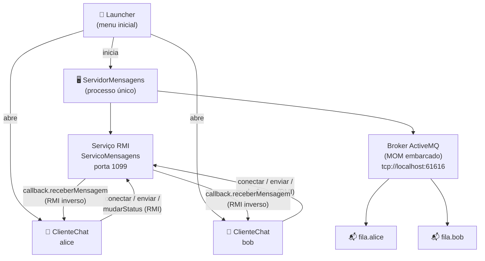
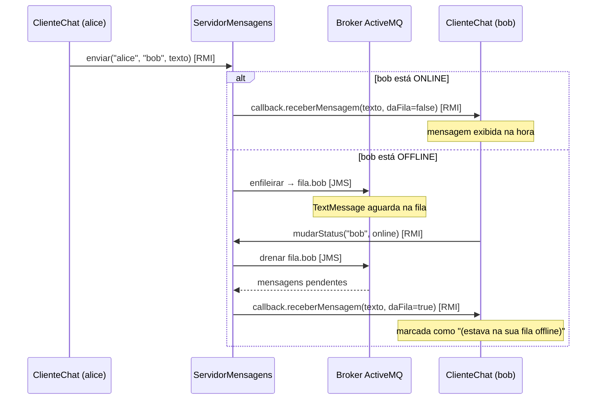

# Projeto Final — Mensagens com Controle Offline (Programação Paralela e Distribuída)

Projeto Final — IFCE, Engenharia de Computação, 2025.2. Prof. Cidcley T. de Souza.

Sistema de troca de mensagens em que cada cliente possui um **nome de contato**
e uma **lista de amigos** sempre visível na tela. A comunicação tem uma **parte
online** e uma **parte offline**:

* **Online** — quando o destinatário está online, a mensagem é entregue
  **na hora**, via callback RMI (o servidor chama um método remoto do cliente).
* **Offline** — quando o destinatário está offline, a mensagem é depositada na
  **fila dele** no **Servidor de Mensagens**, gerenciada por um **MOM**
  (JMS/ActiveMQ). Ao voltar a ficar online, ele recebe tudo o que estava
  aguardando na fila.

O Servidor de Mensagens é um **servidor remoto acessado via RMI** — os clientes
nunca falam JMS diretamente; toda a comunicação passa pelo serviço RMI.

---

## 1. Estrutura

```
ProjetoFinal/
├── Makefile                            # Build e execucao com javac/jar (sem Maven)
├── lib/                                # JARs do ActiveMQ/JMS (dependencias)
├── executar.sh                         # Atalho para rodar o JAR (menu principal)
└── src/main/java/br/edu/ifce/chat/
    ├── Config.java                     # Porta RMI, URL do broker, nomes das filas
    ├── ServicoMensagens.java           # Interface RMI do servidor (contrato)
    ├── ClienteCallback.java            # Interface RMI de callback do cliente
    ├── ServidorMensagens.java          # Servidor: broker MOM + filas JMS + RMI + UI
    ├── ClienteChat.java                # Cliente: contatos, status on/off, conversas
    ├── Launcher.java                   # Menu inicial (abre servidor e clientes)
    └── Tema.java                       # Design system Swing (cores, botoes, cards)
```

---

## 2. Como compilar e executar

Requisitos: **JDK 11+** (apenas `javac`/`jar`, sem Maven). As dependências do
ActiveMQ/JMS já acompanham o projeto na pasta `lib/`.

```bash
make            # compila para build/
make jar        # gera projeto-final.jar (usa lib/ ao lado)
make run        # compila e abre o menu principal (Launcher)

# ou, ja tendo o JAR gerado:
./executar.sh   # roda o projeto-final.jar (menu principal)
```

> O Servidor e os Clientes são abertos pelos botões **Iniciar servidor** e
> **+ Novo Cliente** do Launcher. Para abri-los direto (sem o menu), use
> `make run-servidor` e `make run-cliente` (ou `make run-cliente ARGS="alice"`).
>
> Em Windows (sem make): `javac -cp "lib/*" -d build src/main/java/br/edu/ifce/chat/*.java`
> e depois `java -cp "build;lib/*" br.edu.ifce.chat.Launcher`.

Para usar o cliente em **outra máquina**, informe o IP do servidor no campo
"Servidor (host)" do login. A porta RMI (1099) e a URL do broker podem ser
alteradas com `CHAT_RMI_PORT` e `CHAT_BROKER_URL` (ou `-Dchat.rmi.port` /
`-Dchat.broker.url`).

---

## 3. Como usar (roteiro de demonstração)

1. Abra o **Launcher** e clique em **Iniciar servidor**. A janela do servidor
   mostra o log de eventos e, à esquerda, as filas de cada cliente com o
   status e a quantidade de mensagens pendentes.
2. Clique em **+ Novo Cliente**, entre como `alice`. Repita e entre como `bob`.
   No log do servidor aparecem as filas `fila.alice` e `fila.bob` sendo criadas.
3. Em cada cliente, clique em **+ Adicionar** e adicione o outro como contato
   (a lista fica sempre visível à esquerda, com bolinha verde para online).
4. Selecione o contato e troque mensagens — com os dois online, a entrega é
   instantânea.
5. No cliente `bob`, clique em **Ficar offline**. Envie mensagens de `alice`
   para `bob`: elas aparecem como *"guardada na fila dele no servidor"* e o
   contador de pendentes da `fila.bob` sobe na janela do servidor.
6. Clique em **Ficar online** no `bob`: todas as mensagens da fila chegam de
   uma vez, marcadas com *"(estava na sua fila offline)"* e com a hora em que
   foram enviadas.
7. Feche a janela do `bob` (sair do sistema) e continue mandando mensagens —
   elas também vão para a fila e são entregues quando ele entrar de novo.

A lista de contatos é salva em `contatos-<nome>.txt`, então os amigos
registrados são restaurados na próxima execução.

---

## 4. Arquitetura



### Fluxo de uma mensagem (`ServidorMensagens.rotear`)



* **Cliente → Servidor (RMI):** `conectar`, `enviar`, `mudarStatus`,
  `estaOnline`, `desconectar` (interface `ServicoMensagens`).
* **Servidor → Cliente (callback RMI):** `receberMensagem` e `statusContato`
  (interface `ClienteCallback`).
* **Servidor → MOM (JMS):** uma `Queue` por cliente (`fila.<nome>`), no broker
  ActiveMQ embarcado — filas ponto-a-ponto em vez de tópicos pub-sub, pois
  cada mensagem tem um único destinatário.

A drenagem usa `CLIENT_ACKNOWLEDGE`: cada mensagem só é confirmada no broker
**depois** que o callback do cliente a aceitou — se o cliente cair no meio da
entrega, o que não foi confirmado volta para a fila.

### Threads e concorrência

* As chamadas RMI chegam em threads do pool do RMI; o estado compartilhado do
  servidor usa `ConcurrentHashMap`/conjuntos concorrentes e cada operação JMS
  abre a própria `Session` (Sessions JMS não são thread-safe).
* Na UI, nada de Swing é tocado fora da EDT: callbacks e respostas RMI são
  repassados com `SwingUtilities.invokeLater`, e as chamadas RMI dos botões
  rodam em threads próprias para não travar a interface.

---

## 5. Mapeamento dos requisitos do PDF

| # | Requisito | Onde está |
|---|-----------|-----------|
| 1 | Nome de contato + lista de amigos sempre visível na UI (1pt) | `ClienteChat`: login com nome; card **Contatos** fixo à esquerda com status e não-lidas |
| 2 | Mudar de estado entre on e off (1pt) | Botão **Ficar offline / Ficar online** → `ServicoMensagens.mudarStatus` |
| 3 | Online ⇒ entrega instantânea (1pt) | `ServidorMensagens.rotear`: callback `receberMensagem` direto |
| 4 | Offline ⇒ servidor de mensagens remoto via SOCKET ou **RMI** (3pts) | `ServicoMensagens` (RMI, porta 1099) — todo acesso ao servidor passa por ele |
| 5 | Fila por cliente gerenciada por um **MOM** (1pt) | Broker ActiveMQ embarcado; `Queue` JMS `fila.<nome>` por cliente |
| 6 | Contato offline ⇒ mensagem vai para a fila do destinatário (1pt) | `ServidorMensagens.enfileirar` (produtor JMS na `fila.<destinatário>`) |
| 7 | Ao entrar, o cliente solicita a criação da sua fila (1pt) | `ServicoMensagens.conectar` → `garantirFila` |
| 8 | Incluir e excluir contatos (1pt) | Botões **+ Adicionar** / **Remover** (persistência em `contatos-<nome>.txt`) |

---

## 6. Observações

* O broker roda **embarcado** no processo do servidor (`setPersistent(false)`),
  então as filas vivem enquanto o servidor estiver no ar — suficiente para o
  cenário do projeto. Para sobreviver a reinícios do servidor bastaria ativar a
  persistência do ActiveMQ (`setPersistent(true)`).
* Se um cliente cair sem se desconectar, o servidor detecta a falha do callback
  no próximo envio, passa a tratá-lo como offline e enfileira a mensagem.
* Nomes de contato aceitam letras, números, `-` e `_` (viram parte do nome da
  fila no broker).
